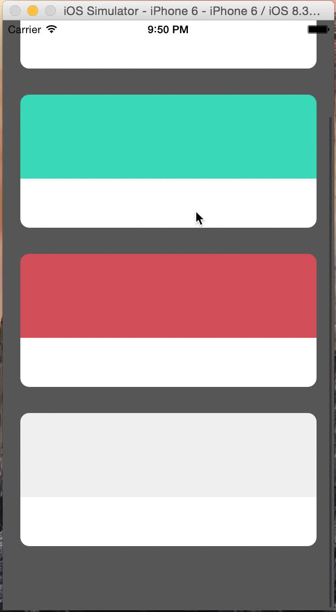

# MCMHeaderAnimated

```MCMHeaderAnimated``` allows you to add an animation between list and detail views.

<p align="center">
	
</p>

*Note: The sample code design was inspired by [Tryolabs Mobile Showcase](http://blog.tryolabs.com/2015/05/12/tryolabs-mobile-showcase-going-full-mobile/)*

## Usage

First, import ```MCMHeaderAnimated```:

```swift
import MCMHeaderAnimated
```

Create a new instance of ```MCMHeaderAnimated``` in the list controller, like this:

```swift
private let transitionManager = MCMHeaderAnimated()
```

then, assign that to the transitioningDelegate property of the destination controller:

```swift
destination.transitioningDelegate = self.transitionManager
```

and finally extend MCMHeaderAnimatedDelegate and implement __headerView__ and __headerCopy__ functions in both controllers.

If you want to add user interaction to dismiss detail view, like the example, you can add the following line:

```swift
self.transitionManager.destinationViewController = destination
```

## Requirements

iOS 8.0+

## Installation

### CocoaPods

MCMHeaderAnimated is available through [CocoaPods](http://cocoapods.org). To install
it, simply add the following line to your Podfile:

```ruby
use_frameworks!
pod "MCMHeaderAnimated"
```

Then, run the following command:

```
$ pod install
```

### Manual

If you prefer not to use [CocoaPods](http://cocoapods.org), you can integrate MCMHeaderAnimated into your project manually. Just drag and drop all files in the [__Source__](Source) folder into your project.

## Demo

Build and run the example project in Xcode to see MCMHeaderAnimated in action.

## Author

Mathias Carignani, mathcarignani@gmail.com

## License

MCMHeaderAnimated is available under the MIT license. See the LICENSE file for more info.
